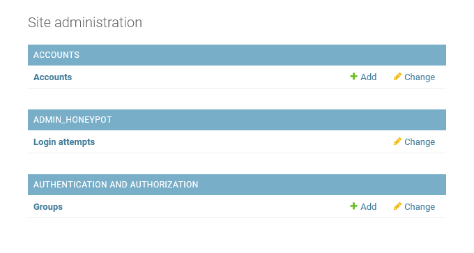

# Custom Django authentication form

## Current features
* Registration
* Log in
* Email verification
* Password reset
* Error handling
* Prevent unauthorized access to pages
* Admin honeypot
* Form honeypot

## Upcoming features
* Social media log in

### **Styling has been done with TailwindCSS/UI**

